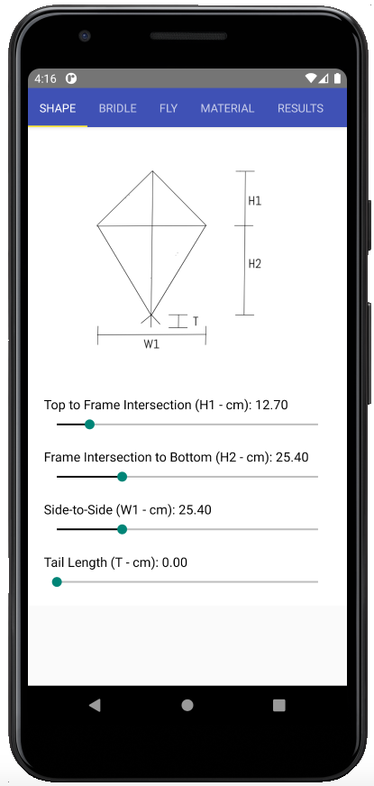

# KiteModeler - Reboot

This repository contains the open-source back-end and front-end
code for KiteModeler-Reboot-RN, which is a modern
version of [KiteModeler](https://www.grc.nasa.gov/WWW/K-12/airplane/kiteprog.html) from NASA Glenn. 
Also check out the Python version here [repo](github.com/gpavanb1/KiteModeler) [live demo](kite-modeler.herokuapp.com/)

The code has been written using Typescript React. This app will remain free and open-source.

## How to install

Download the APK files, which you can find in the **Releases** 👉

## How to build and execute
* Run the build tool in one terminal using `npx react-native start`
* Create the app in another terminal using `npx react-native run-android` or `npx react-native run-ios` 
depending on the platform of choice

## How to test

Tests can be run using `npm test` and coverage report can be obtained by adding `-- --coverage` to it

## Sample

## Whom to contact?

Please direct your queries to [gpavanb1](http://github.com/gpavanb1)
for any questions.

## Acknowledgements

* The original KiteModeler can be found [here](https://www.grc.nasa.gov/www/k-12/airplane/kiteprog.html)

* The bounded minimization routine has been borrowed from the [Scipy]() implementation in Python
and adapted for Typescript.

* Hat-tip to [Sujeet](https://github.com/sujeet) for suggesting a JS implementation.